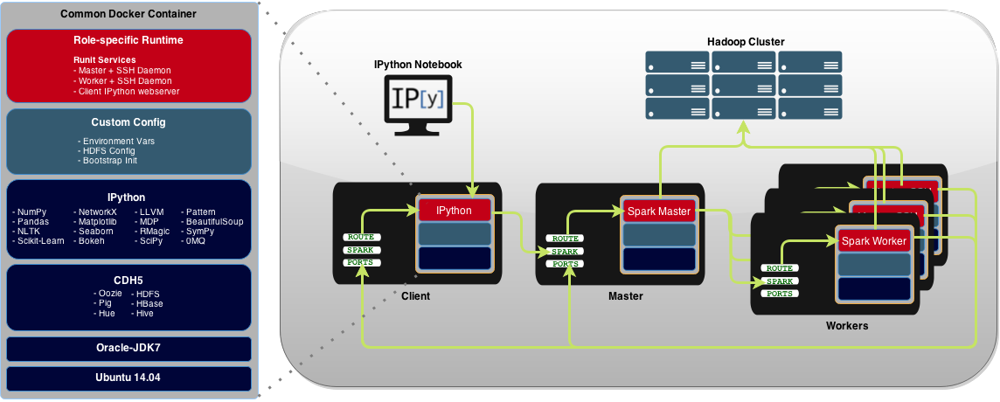

# ipython-spark-docker

This repo provides [Docker](http://www.docker.io) containers to run:
  - [Spark](https://spark.apache.org) master and worker(s) for running Spark in standalone mode on dedicated hosts
  - [Mesos](http://mesos.apache.org)-enhanced containers for Mesos-mastered Spark jobs
  - [IPython](http://ipython.org) web interface for interacting with Spark or Mesos master via [PySpark](https://spark.apache.org/docs/0.9.0/python-programming-guide.html)

Please see the accompanying blog posts for the technical details and motivation behind this project:
  - <a href="http://lab41.github.io/blog/2015/04/13/ipython-on-spark-on-docker" target="_blank">Using Docker to Build an IPython-driven Spark Deployment</a>
  - <a href="http://lab41.github.io/blog/2015/07/28/triplewide-trailer-looking-to-rig-ipython" target="_blank">Triplewide Trailer, Part 1: Looking to Hitch IPython, Spark, and Mesos to Docker</a>

## Architecture
Docker containers provide a portable and repeatable method for deploying the cluster:
<p align="center">
    
</p>

### CDH5 Tools and Libraries

<table>
  <tr>
    <td><a href="http://hadoop.apache.org/" target="_blank">HDFS</a></td>
    <td><a href="http://hbase.apache.org/" target="_blank">Hbase</a></td>
    <td><a href="https://hive.apache.org/" target="_blank">Hive</a></td>
    <td><a href="http://oozie.apache.org/" target="_blank">Oozie</a></td>
    <td><a href="http://pig.apache.org/" target="_blank">Pig</a></td>
    <td><a href="http://gethue.com/" target="_blank">Hue</a></td>
  </tr>
</table>


### Python Packages and Modules

<table>
    <tr>
      <td><a href="http://www.clips.ua.ac.be/pattern" target="_blank">Pattern</a></td>
      <td><a href="http://nltk.org" target="_blank">NLTK</a></td>
      <td><a href="http://pandas.pydata.org" target="_blank">Pandas</a></td>
      <td><a href="http://www.numpy.org" target="_blank">NumPy</a></td>
      <td><a href="http://scipy.org" target="_blank">SciPy</a></td>
      <td><a href="http://sympy.org" target="_blank">SymPy</a></td>
      <td><a href="http://stanford.edu/~mwaskom/software/seaborn/" target="_blank">Seaborn</a></td>
    </tr>
    <tr>
      <td><a href="http://cython.org" target="_blank">Cython</a></td>
      <td><a href="http://numba.pydata.org" target="_blank">Numba</a></td>
      <td><a href="http://biopython.org" target="_blank">Biopython</a></td>
      <td><a href="http://ipython.org/ipython-doc/dev/config/extensions/rmagic.html" target="_blank">Rmagic</a></td>
      <td><a href="http://zeromq.org/bindings:python" target="_blank">0MQ</a></td>
      <td><a href="http://matplotlib.org/" target="_blank">Matplotlib</a></td>
      <td><a href="http://scikit-learn.org/" target="_blank">Scikit-Learn</a></td>
    </tr>
    <tr>
      <td><a href="http://statsmodels.sourceforge.net/" target="_blank">Statsmodels</a></td>
      <td><a href="http://www.crummy.com/software/BeautifulSoup/" target="_blank">Beautiful Soup</a></td>
      <td><a href="https://networkx.github.io/" target="_blank">NetworkX</a></td>
      <td><a href="http://numba.pydata.org/" target="_blank">LLVM</a></td>
      <td><a href="http://bokeh.pydata.org/" target="_blank">Bokeh</a></td>
      <td><a href="https://github.com/wrobstory/vincent" target="_blank">Vincent</a></td>
      <td><a href="http://mdp-toolkit.sourceforge.net/" target="_blank">MDP</a></td>
    </tr>
</table>


## Usage

### Option 1. Mesos-mastered Spark Jobs
1. <strong>Install Mesos with Docker Containerizer and Docker Images</strong>: Install a Mesos cluster configured to use the Docker containerizer, which enables the Mesos slaves to execute Spark tasks within a Docker container.

    A. <strong>End-to-end Installation</strong>: The script ```mesos/1-setup-mesos-cluster.sh``` uses the Python library [Fabric](http://www.fabfile.org/) to install and configure a cluster according to [How To Configure a Production-Ready Mesosphere Cluster on Ubuntu 14.04](https://www.digitalocean.com/community/tutorials/how-to-configure-a-production-ready-mesosphere-cluster-on-ubuntu-14-04).  After installation, it also pulls the Docker images that will execute Spark tasks.  To use:
    - Update IP Addresses of Mesos nodes in ```mesos/fabfile.py```. Find instances to change with:
    <pre><code>grep 'ip-address' mesos/fabfile.py</code></pre>

    - Install/configure the cluster:
    <pre><code>./mesos/1-setup-mesos-cluster.sh</code></pre>
    Optional: ```./1-build.sh``` if you prefer instead to build the docker images from scratch (rather than the script pulling from Docker Hub)

    B. <strong>Manual Installation</strong>: Follow the general steps in ```mesos/1-setup-mesos-cluster.sh``` to manually install:

    - Install mesosphere on masters
    - Install mesos on slaves
    - Configure zookeeper on all nodes
    - Configure and start masters
    - Configure and start slaves
    - Load docker images:
      <pre><code>docker pull lab41/spark-mesos-dockerworker-ipython
docker pull lab41/spark-mesos-mesosworker-ipython</code></pre>


2. <strong>Run the client container on a client host</strong> (replace 'username-for-sparkjobs' and 'mesos-master-fqdn' below): <pre><code>./5-run-spark-mesos-dockerworker-ipython.sh username-for-sparkjobs mesos://mesos-master-fqdn:5050</code></pre>
*Note: the client container will create username-for-sparkjobs when started, providing the ability to submit Spark jobs as a specific user and/or deploy different IPython servers for different users.


### Option 2. Spark Standalone Mode
**Installation and Deployment** - Build each Docker image and run each on separate dedicated hosts
<div><strong>Tip</strong>: Build a common/shared host image with all necessary configurations and pre-built containers, which you can then use to deploy each node. When starting each node, you can pass the container run scripts as <a href="http://docs.aws.amazon.com/AWSEC2/latest/UserGuide/user-data.html">User data</a> to initialize that container at boot time</div>

0. <strong>Prerequisites</strong>
  - Deploy Hadoop/HDFS cluster. Spark uses a cluster to distrubute analysis of data pulled from multiple sources, including the Hadoop Distrubuted File System (HDFS). The ephemeral nature of Docker containers make them ill-suited for persisting long-term data in a cluster. Instead of attempting to store data within the Docker containers' HDFS nodes or mounting host volumes, it is recommended you point this cluster at an external Hadoop deployment. Cloudera provides complete resources for [installing](http://www.cloudera.com/content/cloudera/en/documentation/cdh5/v5-0-0/CDH5-Installation-Guide/cdh5ig_cdh5_install.html) and [configuring](http://www.cloudera.com/content/cloudera/en/documentation/cdh5/v5-0-0/CDH5-Installation-Guide/cdh5ig_cdh5_cluster_deploy.html) its distribution (CDH) of Hadoop.  This repo has been tested using CDH5.

1. <strong>Build and configure hosts</strong>
  1. Install <a href="http://docs.docker.com/installation/ubuntulinux" target="_blank">Docker v1.5+</a>, <a href="http://packages.ubuntu.com/trusty/jq" target="_blank">jq JSON processor</a>, and <a href="http://packages.ubuntu.com/trusty/iptables" target="_blank">iptables</a>. For example, on an Ubuntu host:
    <pre><code>./0-prepare-host.sh</code></pre>
  2. Update the Hadoop configuration files in ```runtime/cdh5/<hadoop|hive>/<multiple-files>``` with the correct hostnames for your Hadoop cluster.  Use ```grep FIXME -R .``` to find hostnames to change.
  3. Generate new SSH keypair (```dockerfiles/base/lab41/spark-base/config/ssh/id_rsa``` and ```dockerfiles/base/lab41/spark-base/config/ssh/id_rsa.pub```), adding the public key to ```dockerfiles/base/lab41/spark-base/config/ssh/authorized_keys```.
  4. (optional) Update ```SPARK_WORKER_CONFIG``` environment variable for Spark-specific options such as executor cores.  Update the variable via a shell ```export``` command or by updating ```dockerfiles/standalone/lab41/spark-client-ipython/config/service/ipython/run```.
  5. (optional) Comment out any unwanted Python packages in the base Dockerfile image ```dockerfiles/base/lab41/python-datatools/Dockerfile```.

2. <strong>Get Docker images</strong>:
<div>Option A: If you prefer to pull from Docker Hub:
<pre><code>docker pull lab41/spark-master
docker pull lab41/spark-worker
docker pull lab41/spark-client-ipython</code></pre>
<div>Option B: If you prefer to build from scratch yourself:
<pre><code>./1-build.sh</code></pre>
<div>If you are creating common/shared host images, this would be the point to snapshot the host image for replication.</div>

3. <strong>Deploy cluster nodes</strong>
<div>Ensure each host has a Fully-Qualified-Domain-Name (i.e. master.domain.com; worker1.domain.com; ipython.domain.com) for the Spark nodes to properly associate</div>
  1. <strong>Run the master container on the master host</strong>: <pre><code>./2-run-spark-master.sh</code></pre>
  2. <strong>Run worker container(s) on worker host(s)</strong> (replace 'spark-master-fqdn' below): <pre><code>./3-run-spark-worker.sh spark://spark-master-fqdn:7077</code></pre>
  3. <strong>Run the client container on the client host</strong> (replace 'spark-master-fqdn' below): <pre><code>./4-run-spark-client-ipython.sh spark://spark-master-fqdn:7077</code></pre>
